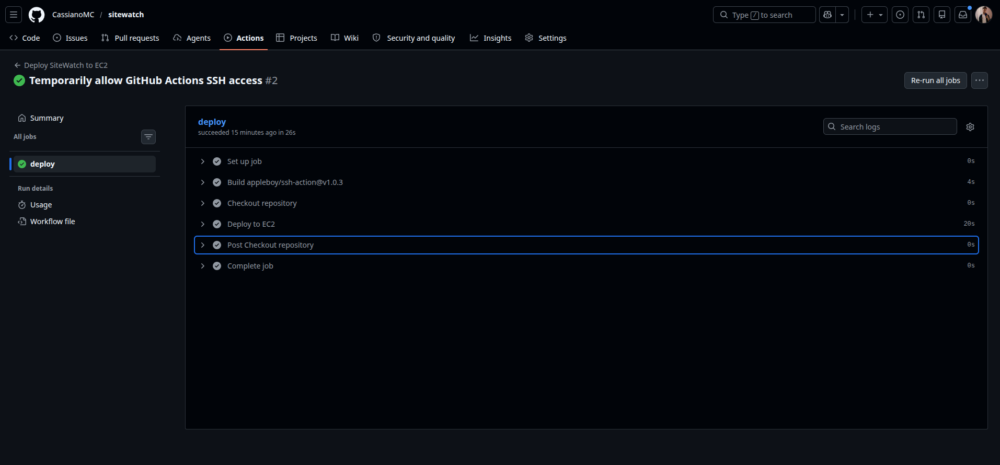
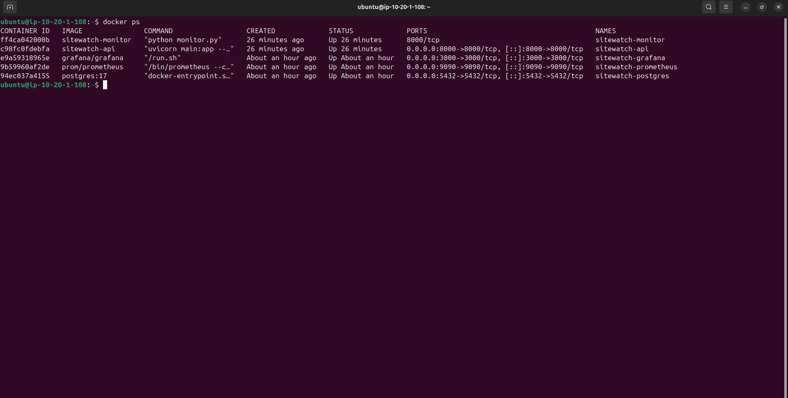
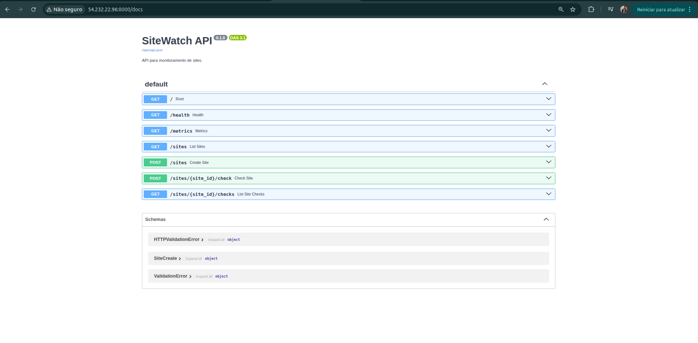
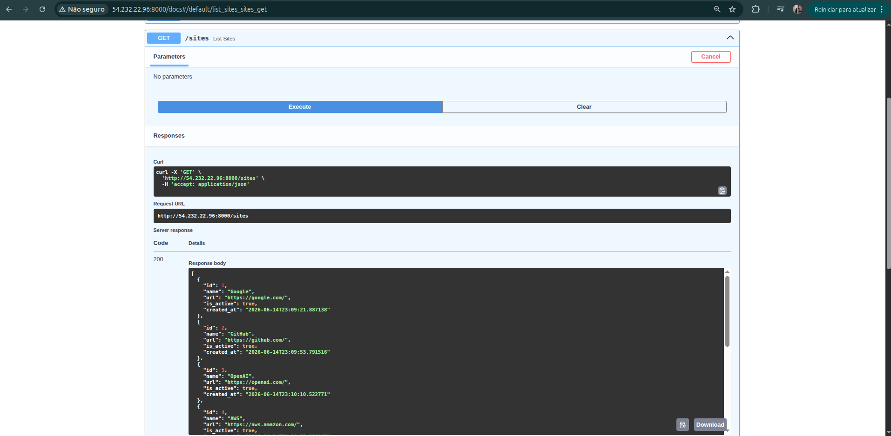
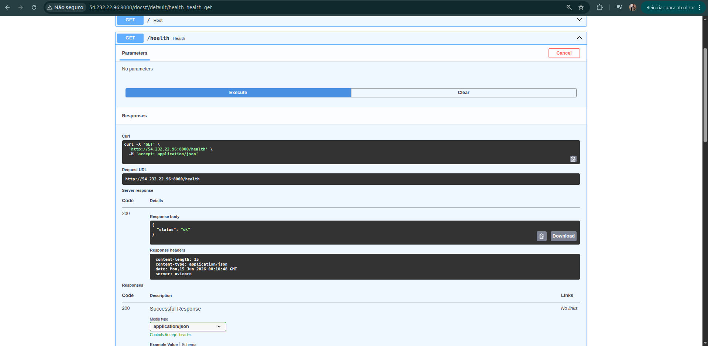
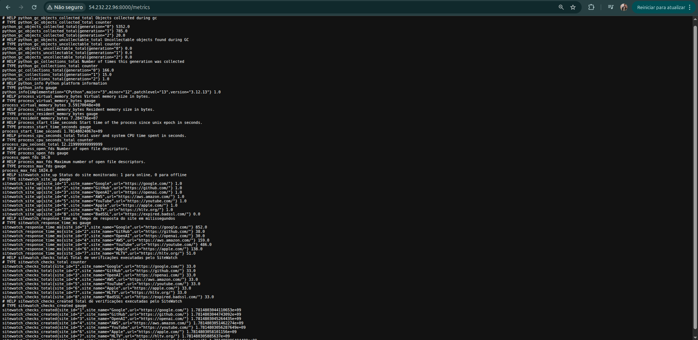
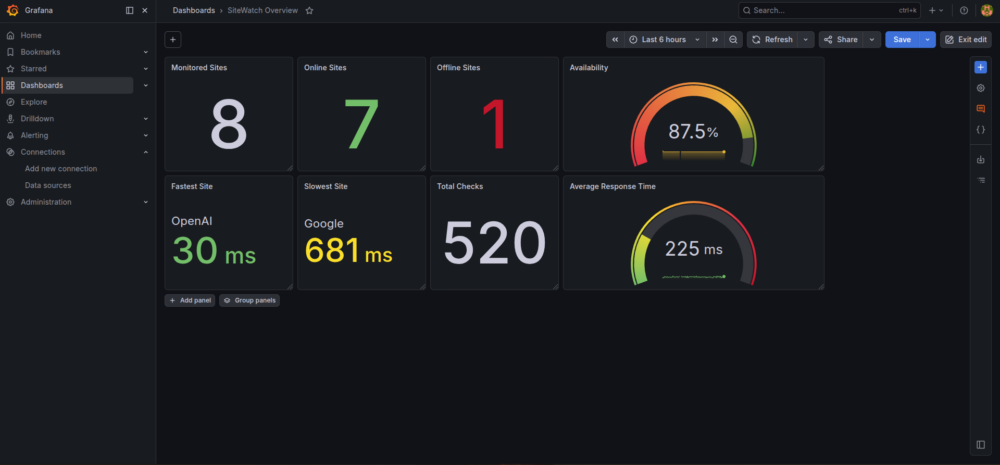

# 🌐 SiteWatch - Plataforma de Monitoramento de Sites


Projeto em desenvolvimento para demonstrar conhecimentos em APIs REST, Banco de Dados, Containerização, CI/CD, Monitoramento e Observabilidade utilizando tecnologias amplamente adotadas em ambientes modernos.

---

# 📋 Sobre o Projeto

O SiteWatch é uma plataforma de monitoramento de sites desenvolvida para realizar verificações periódicas de disponibilidade e tempo de resposta de aplicações e serviços web.

A solução é composta por uma API desenvolvida com FastAPI, um serviço responsável pela execução dos monitoramentos, um banco de dados PostgreSQL para persistência dos resultados e uma stack de observabilidade baseada em Prometheus e Grafana.

Todo o ambiente é executado em containers Docker e implantado automaticamente em uma instância AWS EC2 através de uma pipeline CI/CD utilizando GitHub Actions.

### Conceitos Praticados

* Python
* FastAPI
* APIs REST
* PostgreSQL
* Docker
* Docker Compose
* GitHub Actions
* CI/CD
* AWS EC2
* Prometheus
* Grafana
* Monitoramento
* Observabilidade
* Coleta de Métricas
* Desenvolvimento Backend
* Automação de Infraestrutura

---

# 🔗 Links

## 📂 Repositório

https://github.com/cassianomc/sitewatch

---

# 🏗️ Arquitetura da Solução

```text
                     Git Push
                         │
                         ▼
┌──────────────────────────────────┐
│             GitHub               │
└───────────────┬──────────────────┘
                │
                ▼
┌──────────────────────────────────┐
│         GitHub Actions           │
│      Build + Deploy Pipeline     │
└───────────────┬──────────────────┘
                │
                ▼
┌──────────────────────────────────┐
│              AWS EC2             │
└───────────────┬──────────────────┘
                │
                ▼
┌─────────────────────────────────────────────┐
│                Docker Host                  │
│                                             │
│  ├── SiteWatch API                          │
│  ├── SiteWatch Monitor                      │
│  ├── PostgreSQL                             │
│  ├── Prometheus                             │
│  └── Grafana                                │
└─────────────────────────────────────────────┘
```

---

# 📊 Arquitetura de Monitoramento

```text
          Verificações de Sites
                    │
                    ▼
            SiteWatch Monitor
                    │
                    ▼
               PostgreSQL
                    │
                    ▼
               FastAPI API
                    │
                    ▼
          Métricas Prometheus
                    │
                    ▼
               Prometheus
                    │
                    ▼
                 Grafana
```

---

# 📸 Evidências do Projeto

As imagens abaixo demonstram o funcionamento real da plataforma, incluindo endpoints da API, métricas de monitoramento, pipeline CI/CD e dashboards de observabilidade.

## 🔄 Pipeline CI/CD

### Deploy Automatizado com GitHub Actions



---

## 🐳 Containers em Produção

### Containers Docker Executando na AWS EC2



---

## 📚 Documentação da API

### FastAPI Swagger UI



---

## 🌐 Sites Monitorados

### Endpoint de Sites



---

## ❤️ Health Check

### Endpoint de Saúde da Aplicação



---

## 📈 Métricas Exportadas

### Endpoint de Métricas Prometheus



---

## 📊 Dashboard de Monitoramento

### Dashboard Overview no Grafana



---

# 🛠️ Tecnologias Utilizadas

## Desenvolvimento Backend

* Python
* FastAPI

## Banco de Dados

* PostgreSQL

## Containerização

* Docker
* Docker Compose

## CI/CD

* GitHub Actions

## Cloud

* AWS EC2

## Monitoramento e Observabilidade

* Prometheus
* Grafana

## Sistema Operacional

* Ubuntu Linux

## Controle de Versão

* Git
* GitHub

---

# 📁 Estrutura do Projeto

```text
sitewatch/
│
├── .github/
│   └── workflows/
│       └── deploy.yml
│
├── app/
│   ├── Dockerfile
│   ├── main.py
│   ├── monitor.py
│   └── requirements.txt
│
├── docs/
│   └── images/
│
├── infrastructure/
│   └── terraform/
│
├── observability/
│   ├── grafana/
│   └── prometheus/
│
├── docker-compose.yml
├── README.md
└── .gitignore
```

---

# 🐳 Containerização

Toda a plataforma é executada em containers Docker, garantindo portabilidade, padronização e facilidade de implantação em diferentes ambientes.

### Serviços Executados

* SiteWatch API
* SiteWatch Monitor
* PostgreSQL
* Prometheus
* Grafana

### Benefícios

* Padronização de ambiente
* Facilidade de Deploy
* Isolamento de serviços
* Escalabilidade
* Reprodutibilidade

---

# 🔄 Pipeline CI/CD

Toda alteração enviada para a branch principal dispara automaticamente a pipeline de deploy.

```bash
git add .
git commit -m "Atualização"
git push origin main
```

A pipeline executa automaticamente:

1. Checkout do código
2. Build da imagem Docker
3. Publicação da imagem
4. Conexão SSH com a EC2
5. Pull da nova imagem
6. Atualização dos containers
7. Deploy automático da nova versão

Todo o processo de implantação é realizado através do GitHub Actions.

---

# 📈 Monitoramento e Observabilidade

Foi implementada uma stack de observabilidade para monitorar disponibilidade, tempo de resposta e funcionamento da plataforma.

### Prometheus

Responsável pela coleta e armazenamento das métricas exportadas pela aplicação.

### Grafana

Responsável pela visualização e análise das métricas através de dashboards.

### Métricas Coletadas

* Disponibilidade dos sites
* Tempo de resposta
* Total de verificações executadas
* Status da aplicação
* Estatísticas de monitoramento

### Dashboard Overview

* Monitored Sites
* Online Sites
* Offline Sites
* Availability
* Average Response Time
* Fastest Site
* Slowest Site
* Total Checks

---

# 🎓 Habilidades Demonstradas

✅ Python

✅ FastAPI

✅ APIs REST

✅ PostgreSQL

✅ Docker

✅ Docker Compose

✅ Git

✅ GitHub

✅ GitHub Actions

✅ CI/CD

✅ AWS EC2

✅ Linux

✅ Prometheus

✅ Grafana

✅ Monitoramento

✅ Observabilidade

✅ Coleta de Métricas

✅ Desenvolvimento Backend

✅ Troubleshooting

✅ Automação de Infraestrutura

---

# 🛣️ Roadmap

## Concluído

* [x] Backend FastAPI
* [x] Serviço de Monitoramento de Sites
* [x] Integração com PostgreSQL
* [x] Aplicação Containerizada com Docker
* [x] Deploy em AWS EC2
* [x] Pipeline CI/CD com GitHub Actions
* [x] Exportação de Métricas para Prometheus
* [x] Dashboard Grafana
* [x] Endpoint de Health Check
* [x] Monitoramento de Disponibilidade de Sites
* [x] Monitoramento de Tempo de Resposta

## Próximas Evoluções

* [ ] Integração com Alertmanager
* [ ] Notificações via Discord
* [ ] Monitoramento de Certificados SSL
* [ ] Notificações por E-mail
* [ ] Relatórios Históricos de Disponibilidade
* [ ] Dashboard Dedicado de Performance
* [ ] Integração com Loki
* [ ] Centralização de Logs
* [ ] Deploy em Kubernetes
* [ ] Implementação de GitOps

---

# 👨‍💻 Autor

## Cassiano Marinho

DevOps | Cloud | Observabilidade | Desenvolvimento Backend

### Tecnologias

* Python
* FastAPI
* PostgreSQL
* Docker
* AWS
* GitHub Actions
* Prometheus
* Grafana
* Linux

### Atualmente Estudando

* Kubernetes
* GitOps
* Terraform Avançado
* Observabilidade
* Site Reliability Engineering (SRE)

---

⭐ Este projeto faz parte da minha jornada de evolução profissional nas áreas de Desenvolvimento Backend, DevOps, Cloud Computing, Monitoramento, Observabilidade e Site Reliability Engineering.
